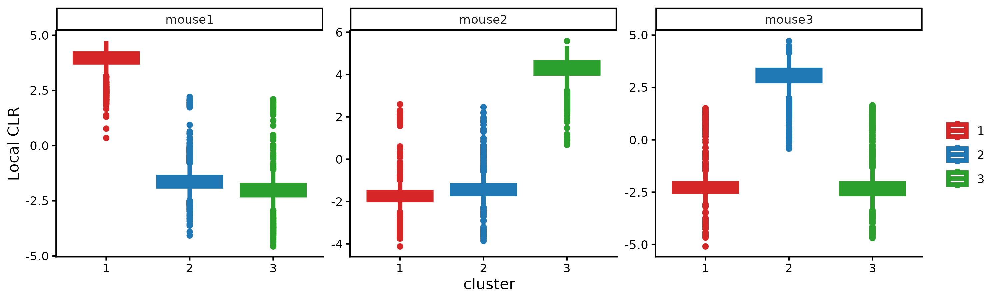
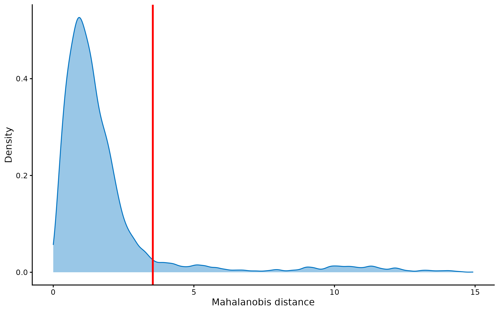

# CMDdemux
CMDdemux is a single-cell demultiplexing tool that identifies each cell from hashtag oligonucleotide (HTO) data. It accurately distinguishes singlets, doublets, and negatives in high-quality data, and remains effective with low-quality data, including weak or strong signals, contamination, empty droplets, and low-input cell hashing data.

## Installation
```
install.packages("devtools")
devtools::install_github("jiananwehi/CMDdemux")
library(CMDdemux)
```

## Vignette
[https://bookdown.org/yeswangjianan/CMDdemux/](https://bookdown.org/yeswangjianan/CMDdemux/) <br>
The vignette above gives a detailed description of how to use CMDdemux with different types of data, and we strongly recommend reading it for full guidance. <br>
This README provides a short introduction for quickly getting started with CMDdemux. <br>

## Case study
In this case study, a high-quality cell hashing data from three mouse samples are used to demonstrate the usage of CMDdemux.

### Local CLR normalization
The first step of CMDdemux is to normalize the hash count data using a local CLR normalization.  

```
clr.norm <- LocalCLRNorm(hash.count)
```
The input to the `LocalCLRNorm` function is a hash count matrix, with rows corresponding to hashing samples and columns corresponding to cells. The output is a normalized matrix with the same dimensions, where each entry is a normalized value. In addition to being used for downstream demultiplexing, the normalized data can be used for visualization.

### K-medoids clustering
The local CLR normalized data is then used to perform clustering. 

```
kmed.cl <- KmedCluster(clr.norm)
```

A boxplot is then used to evaluate the clustering results.

```
CheckCLRBoxPlot(clr.norm, kmed.cl)
```

 <br>

We expect to see that each hashtag is highly and uniquely expressed in one cluster, indicating that three clusters are reasonable for this dataset.

Next, Euclidean distance for each cell to its cluster centroid is calculated. 

```
cl.dist <- EuclideanClusterDist(clr.norm, kmed.cl)
```

### Definition of non-core cells

Core cells are defined as cells that are closer to their cluster centroids, while non-core cells are those that are farther away from the cluster centroid. The cut-off between core and non-core cells can be determined using `EuclideanDistPlot`, which visualizes the cut-off based on the quantile of the distribution via the `eu_cut_q` parameter, shown as the red line in the following plot.

 <br>

Cells with Euclidean distances larger than the cut-off in the above plot are defined as non-core cells; otherwise, they are core cells. For this dataset, the cut-offs are set at the tails of each distribution. <br>

The cut-offs selected from the plots above are then used to define the non-core cells.

```
noncore <- DefineNonCore(cl.dist, kmed.cl, eu_cut_q = c(0.86, 0.91, 0.876))
```

The output is a vector of labels for each cell. Core cells are assigned their cluster labels, while non-core cells are labeled as "non-core". <br>

The definition of core and non-core cells is further examined using `CLRPlot`. 

```
CLRPlot(clr.norm, kmed.cl, noncore)
```

 <br>

In the plots above, cluster centroids are shown as cross symbols. Core cells cluster around their centroid, while non-core cells lie at the edges of each cluster.

### Label clusters by sample

Next, each cluster is labelled by its original hashtag sample. For the `label_method` parameter, we commonly use the default option, but if the default does not work, we recommend using the alternative choice `"expression"`.

```
cluster.assign <- LabelClusterHTO(clr.norm, kmed.cl, noncore, label_method = "medoids")
```

`LabelClusterHTO` outputs the corresponding cluster index for each sample.

### Computing the Mahalanobis distance

The Mahalanobis distance for each single cell can be calculated using `CalculateMD`.

```
md.mat <- CalculateMD(clr.norm, noncore, kmed.cl, cluster.assign)
```

The output is a Mahalanobis distance matrix with rows representing hashtag samples and columns representing cells. Each entry indicates the Mahalanobis distance of a cell to a given hashtag sample.

### Detect outlier cells

Outlier cells, including negatives and doublets, are defined based on the distribution of the minimum Mahalanobis distance across all cells, which can be visualized using `MDDensPlot`. The cut-off in the plot is determined by the `md_cut_q` parameter, which specifies the quantile of the distribution and is shown as the red line. Users are encouraged to adjust the cut-off through the `md_cut_q` parameter.

```
MDDensPlot(md.mat, md_cut_q = 0.91)
```

 <br>

The assumption is that singlets should be closer to the cluster centroids, while outlier cells should be farther away. In this dataset, the distribution is right-skewed with a long tail, so the cut-off is set at the tail to identify outliers. <br>

Outlier cells are then defined using `AssignOutlierDrop` according to the cut-off selected from the plot.

```
outlier.assign <- AssignOutlierDrop(md.mat, md_cut_q = 0.91)
```

The output of `AssignOutlierDrop` assigns each cell as either “Outlier” or “Singlet”.

### Demultiplexing

The HTO library sizes are used to further distinguish negatives and doublets among the outlier cells. The distribution of HTO library sizes can be visualized using `OutlierHTOPlot`.

```
OutlierHTOPlot(hash.count, outlier.assign, num_modes = 4)
```

 <br>

The possible cut-offs for distinguishing negatives and doublets are shown as red vertical lines, representing the modes and anti-modes of the distribution. The distribution is tri-modal, and the default value of the parameter `num_modes` (the number of modes to detect) is insufficient to capture all modes and anti-modes. Therefore, we set `num_modes` to 4 for this dataset. Users can then select an appropriate cut-off based on the line index. The assumption is that negative cells have smaller HTO library sizes, whereas doublets have larger HTO library sizes.

```
cmddemux.assign <- CMDdemuxClass(md.mat, hash.count, outlier.assign, use_gex_data = TRUE, gex.count = gex.count, num_modes = 4, cut_no = 4)
```

Gene expression data are available for this dataset, so `use_gex_data` is set to TRUE, and the gene expression count data are provided via the `gex.count` parameter. <br>

CMDdemux provides four types of outputs: <br>
`demux_id`: the identity for each cell, determined by the sample with the minimum Mahalanobis distance for that cell. <br>
`global_class`: classification of each cell as Singlet, Doublet, or Negative. <br>
`demux_global_class`: singlet cells are labeled with their original sample, while negatives and doublets are labeled accordingly.<br>
`doublet_class`: similar to `demux_global_class`, but doublets are labeled with their sample of origin. This is particularly useful for combined-hashtag experiments. <br>
